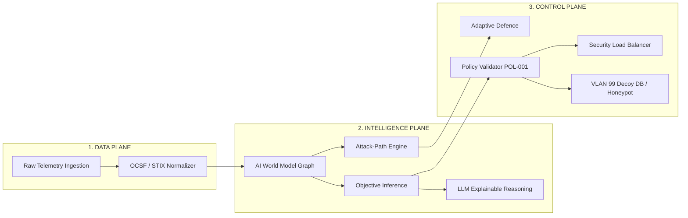

# 🛡️ CHRONOS-WS
### Autonomous AI Cybersecurity, Attack-Path Prediction & Adaptive Deception Platform

> **Predict. Defend. Deceive.**  
> Shift cyber defense from static, reactive rule-matching to an autonomous, predictive, and deceptive counter-engagement paradigm.

---

## 📋 Table of Contents
- [🚀 Quick Start Guide](#-quick-start-guide)
- [🎯 Judge Elevator Pitch Script](#-60-second-judge-elevator-pitch-script)
- [🏛️ System Architecture](#-system-architecture-the-3-planes)
- [🖥️ Comprehensive Page-by-Page Guide](#%EF%B8%8F-comprehensive-page-by-page-guide)
  - [1. Executive Dashboard (`/dashboard`)](#1-executive-dashboard-dashboard)
  - [2. Network & Defense Control (`/network`)](#2-network--defense-control-network)
  - [3. AI & Predictions (`/ai`)](#3-ai--predictions-ai)
  - [4. Attack Path Analyzer (`/attack-path`)](#4-attack-path-analyzer-attack-path)
  - [5. Adaptive Defence Engine (`/defence`)](#5-adaptive-defence-engine-defence)
  - [6. Deception Zone (`/deception`)](#6-deception-zone-deception)
  - [7. Telemetry Stream Inspector (`/telemetry`)](#7-telemetry-stream-inspector-telemetry)
  - [8. Analytics & Reports (`/reports`)](#8-analytics--reports-reports)
  - [9. User Management (`/admin/users`)](#9-user-management-adminusers)
  - [10. Security Audit Logs (`/admin/audit`)](#10-security-audit-logs-adminaudit)
  - [11. Platform Settings (`/settings`)](#11-platform-settings-settings)
  - [12. Authentication Pages (`/login`, `/forgot-password`, `/unauthorized`)](#12-authentication-pages-login-forgot-password-unauthorized)
- [🧩 Global Layout & Operator Controls](#-global-layout--operator-controls)
- [🎬 Live Deterministic Judge Demo Script](#-live-30-second-judge-presentation--11-step-demo-script)
- [🛡️ Judge FAQ Cheat Sheet](#-judge-faq-cheat-sheet)
- [🧪 Verification & Testing Commands](#-verification--testing-commands)

---

## 🚀 Quick Start Guide

### 1. Backend Service Setup (FastAPI + PyTorch)
```bash
cd backend
source ../venv/bin/activate  # Activate Python environment
uvicorn app.main:app --reload --port 8000
```
- **API Base URL**: `http://localhost:8000/api/v1`
- **Swagger Interactive Docs**: `http://localhost:8000/docs`
- **Realtime WebSocket Endpoint**: `ws://localhost:8000/api/v1/ws`

### 2. Frontend Control Plane Setup (React + TypeScript + Vite)
```bash
cd frontend
npm install
npm run dev
```
- **Web Console UI**: `http://localhost:5173`

---

## 🎯 60-Second Judge Elevator Pitch Script

> **"Judges, current SOC defenses are fundamentally reactive—they wait for an attacker to break a known signature rule before triggering an alert. By then, exfiltration or ransomware encryption is already underway.**
>
> **Introducing CHRONOS-WS. We have shifted defense from static rule-matching to an Autonomous, Predictive, and Deceptive Counter-Engagement Platform.**
>
> **CHRONOS-WS doesn't just log attacks; it uses a Graph Neural AI World Model to forecast where the attacker will move next ($S_{t+1}$), infers their hidden objective, dynamically reroutes traffic via a security-aware load balancer, and traps them in isolated Honeypot Decoy Zones—keeping production assets 100% safe while capturing adversary TTPs."**

---

## 🏛️ System Architecture: The 3 Planes



1. **Data Plane (Ingestion Pipeline)**: Sub-50ms ingestion & schema normalization of Syslog, NetFlow, and PCAP data into standard OCSF schemas.
2. **Intelligence Plane (Predictive Engine)**:
   - **AI World Model**: Digital Twin of network states predicting state transitions ($S_t \rightarrow S_{t+1}$).
   - **Attack-Path Engine**: Multi-hop graph traversal forecasting lateral movement vectors 30s into the future.
   - **Objective Inference Engine**: Probabilistic Bayesian model calculating adversary targets.
   - **LLM Reasoning Module**: Plain-language AI threat breakdown and mitigation synthesis.
3. **Control / Response Plane (Autonomous Countermeasures)**:
   - **Policy Validator (`POL-001`)**: Enforces safety guardrails to ensure autonomous actions preserve production SLA/uptime.
   - **Security Load Balancer**: Dynamically adjusts server traffic weights to isolate suspicious IP connections.
   - **Adaptive Deception Zone**: Spawns isolated container honeypots (Decoy DB, Decoy API, Decoy Admin) on Subnet `192.168.99.0/24`.

---

## 🖥️ Comprehensive Page-by-Page Guide

CHRONOS-WS features a narrative-driven, role-protected security control plane. Below is the detailed breakdown of every page within the platform:

---

### 1. Executive Dashboard (`/dashboard`)
*The central command hub for SOC operators and security executives.*

- **System Health & Status Header**: Live status indicators for the Data Plane, Intelligence Engine, Policy Guard, and Deception Zone.
- **Narrative Threat Story Widget ("Current Situation")**: Synthesizes complex raw alerts into a human-readable, plain-language narrative explaining what is happening right now, why it matters, and recommended immediate actions.
- **Closed-Loop Workflow Stepper**: Visual step-by-step indicator highlighting the active closed-loop phase:
  $$\text{OBSERVE} \longrightarrow \text{NORMALIZE} \longrightarrow \text{PREDICT} \longrightarrow \text{INFER OBJECTIVE} \longrightarrow \text{VALIDATE POLICY} \longrightarrow \text{DEPLOY DECEPTION} \longrightarrow \text{FEEDBACK}$$
- **Threat Level & Metric Gauges**: Displays current system risk level (Low, Medium, High, Critical), active incidents counter, active decoys counter, and network throughput.
- **Live Defense Action Ticker**: Real-time stream of automated and manual defense actions executed across the cluster.
- **Quick Action Launcher**: Buttons to trigger the **Deterministic Demo (`seed=42`)**, reset simulation state, or switch defense modes.

---

### 2. Network & Defense Control (`/network`)
*Combines interactive network topology visualization with stateful security policy enforcement.*

- **Interactive Node Topology Canvas**:
  - Displays real production nodes (*Inbound Gateway*, *Firewall*, *App Server A*, *App Server B*, *Production PostgreSQL DB*) alongside *VLAN 99 Honeypot Decoys*.
  - Node health indicators, CPU/Memory load percentages, connection latency, and active packet throughput.
  - Threat status highlighting: Nodes targeted by lateral movement are highlighted with animated threat rings.
- **Security Matrix Policy Table**:
  - Displays 9 layers of active firewall and packet filtering rules.
  - Columns: Rule ID, Priority, Source Subnet, Destination Node, Protocol/Port, Action (`ALLOW`, `DENY`, `REROUTE_DECOY`, `RATE_LIMIT`), and Hit Counters.
  - Interactive rule toggle and priority modifier for SOC analysts.
- **Security-Aware Load Balancer Panel**:
  - Real-time server weight distribution sliders (e.g., Server A: 50%, Server B: 50% $\rightarrow$ Server B: 10% under attack).
  - Health check indicators and connection draining status.

---

### 3. AI & Predictions (`/ai`)
*Deep dive into the AI World Model, Bayesian objective estimation, and LLM-powered threat reasoning.*

- **AI World Model State Predictor**:
  - Displays current network state $S_t$ alongside the predicted future state $S_{t+1}$.
  - State transition probability graph showing expected asset compromise likelihood within 30 seconds.
- **Attacker Objective Inference Engine**:
  - Probabilistic breakdown of estimated adversary targets:
    - 🔑 **Credential Access & Reconnaissance**
    - 🗄️ **Database Data Exfiltration**
    - ⚡ **Privilege Escalation & Lateral Spread**
    - 💣 **Ransomware / Data Destruction**
  - Includes confidence interval bars and historical probability trend charts.
- **LLM Explainable Cyber Reasoning (`llm_reasoning.py`)**:
  - Plain-language AI summary explaining the attacker's observed behavior.
  - Technical analysis of anomalous techniques mapped to MITRE ATT&CK.
  - AI-generated defensive recommendation with rationale and safety impact score.

---

### 4. Attack Path Analyzer (`/attack-path`)
*Multi-hop attack vector graph analyzer for predicting and intercepting lateral movement.*

- **Multi-Hop Attack Vector Canvas**:
  - Maps adversary progression step-by-step from Entry Point $\rightarrow$ Compromised Node $\rightarrow$ Target Asset.
  - Hops are categorized into clear status stages:
    - <span style="color:#ef4444">**COMPLETED**</span>: Attack steps already executed by the adversary.
    - <span style="color:#f59e0b">**PREDICTED**</span>: Forecasted next steps ($S_{t+1}$) derived from the AI World Model.
    - <span style="color:#10b981">**DECEIVED**</span>: Vector successfully intercepted and diverted into a VLAN 99 Decoy.
- **MITRE ATT&CK TTP Mapping Card**:
  - Links each hop to standard MITRE TTP identifiers (e.g., `T1110.001` Brute Force, `T1021.002` SMB/RPC Lateral Movement, `T1041` Exfiltration Over C2).
- **Blast Radius & Interception Analysis**:
  - Calculates potential business impact score if the attack path completes.
  - Identifies optimal "Bottleneck Interception Nodes" to sever the attack chain with minimal disruption to benign traffic.

---

### 5. Adaptive Defence Engine (`/defence`)
*Autonomous closed-loop orchestration center for reviewing, validating, and deploying countermeasures.*

- **4-Stage Action Execution Lifecycle**:
  $$\text{RECOMMENDED} \longrightarrow \text{POLICY VALIDATED} \longrightarrow \text{EXECUTING} \longrightarrow \text{ACTIVE}$$
- **Policy Engine Guardrails (`POL-001`)**:
  - Verifies all proposed automated actions against strict safety constraints before execution (e.g., *Never block primary gateway*, *Maintain minimum 10% bandwidth for production DB*).
  - Displays validation status badge (`POLICY VALIDATED` or `BLOCKED_BY_GUARDRAIL`).
- **Autonomous vs. Manual (HITL) Mode Toggle**:
  - **Closed-Loop Auto Mode**: System automatically deploys validated countermeasures.
  - **Human-in-the-Loop Mode**: System queues actions and waits for explicit SOC operator approval.
- **Mitigation Action History & Reversion**:
  - Comprehensive log of active IP blocks, firewall rule inserts, rate-limit drops, and decoy redirects.
  - One-click **Rollback Action** capability to instantly restore previous configurations if needed.

---

### 6. Deception Zone (`/deception`)
*Isolated counter-engagement zone managing adaptive decoy containers and honeypot telemetry.*

- **Deception VLAN 99 Isolation Guardrail**:
  - Visual subnet boundary confirming strict network isolation between Production (`10.0.0.0/8`) and Deception Subnet (`192.168.99.0/24`).
  - Highlights zero-route ACL policy preventing honeypot containers from accessing internal production networks.
- **Adaptive Decoy Fleet Status**:
  - 🗄️ **Decoy Database** (Port 5433, IP `192.168.99.10`): Emulates PostgreSQL schema populated with synthetic honeypot data.
  - 🔌 **Decoy API** (Port 8081, IP `192.168.99.20`): Emulates internal REST API endpoints with fake session tokens.
  - 🖥️ **Decoy Admin Console** (Port 8082, IP `192.168.99.30`): Emulates internal management portal.
- **Container Resource Monitor**:
  - Tracks CPU (0.25 vCPU cap) and RAM (256 MB cap) usage per decoy container to prevent resource exhaustion.
- **Deception Interaction Log**:
  - Captures attacker payload drops, SQL injection strings, attempted password lists, and commands executed inside decoy environments.

---

### 7. Telemetry Stream Inspector (`/telemetry`)
*High-throughput event ingestion stream and OCSF schema validation engine.*

- **Live OCSF Event Stream**:
  - High-frequency event ticker displaying real-time security events normalized into Open Cybersecurity Schema Framework (OCSF) standard format.
- **Raw Telemetry Inspector**:
  - Drill-down drawer showing raw JSON/Syslog payloads, source/destination IPs, MAC addresses, port numbers, and TCP flags.
- **Benchmark Dataset State Mapping**:
  - Maps live telemetry features against standard cybersecurity datasets: **CIC-IDS-2018** and **CTU-13**.
  - Shows feature alignment (flow duration, packet size statistics, inter-arrival times, payload entropy).
- **Time-Window Aggregators**:
  - Displays 5-second, 30-second, and 5-minute sliding window metrics used for AI model feature extraction.

---

### 8. Analytics & Reports (`/reports`)
*Forensic summaries, SOC trend metrics, and compliance audit exports.*

- **SOC Threat Trend Charts**:
  - Historical graphs tracking threat levels, incident volume, decoy triggers, and average time-to-containment over 24h, 7d, and 30d windows.
- **Before vs. After Defense Impact Matrix**:
  - Side-by-side comparison proving platform effectiveness:
    - *System Risk Score*: **78% (High) $\rightarrow$ 12% (Low)**
    - *Targeted Server Load*: **34% $\rightarrow$ 10%** (Traffic diverted to decoy)
    - *Production DB Risk*: **High $\rightarrow$ Safe (0 Honeypot Leakage)**
- **Forensic Report Generator**:
  - Generate and export executive summary reports in **PDF**, **JSON**, or **Markdown** formats for post-incident reviews and compliance audits.

---

### 9. User Management (`/admin/users`) *(Admin Only)*
*Role-Based Access Control (RBAC) directory for managing platform operators.*

- **SOC Operator Directory**: View active accounts, email addresses, assigned roles, and last login timestamps.
- **Role & Permission Management**: Assign roles with granular permissions:
  - 👑 **Admin**: Full platform access, user management, audit logs, and policy updates.
  - 🛡️ **SOC Analyst**: View operational dashboards, trigger manual defense actions, and export reports.
  - 👁️ **Viewer**: Read-only access to operational dashboards and threat graphs.

---

### 10. Security Audit Logs (`/admin/audit`) *(Admin Only)*
*Immutably logged security audit trail for governance and compliance.*

- **Platform Activity Audit Log**:
  - Records every administrative action, user login, policy modification, manual defense override, and demo trigger.
- **Log Filters & Search**:
  - Filter by Timestamp, User ID, Action Type (`AUTH_LOGIN`, `DEFENCE_EXECUTE`, `POLICY_MODIFY`, `DECOY_ACTIVATE`), or Impact Level.

---

### 11. Platform Settings (`/settings`)
*Global system configuration and environment management.*

- **API & Service Endpoints**: Configure Backend API URL, WebSocket refresh intervals, and LLM provider keys.
- **Notification & Webhook Integration**: Manage alert webhooks (Slack, Microsoft Teams, PagerDuty).
- **Simulation Controller Settings**: Configure random seed settings (Default: `seed=42`) and toggle between **Demo Mode**, **Simulation Mode**, and **Live Production Mode**.

---

### 12. Authentication Pages (`/login`, `/forgot-password`, `/unauthorized`)
*Secure entry points and permission boundary screens.*

- **Login Page (`/login`)**: Secure JWT-backed authentication interface with demo role quick-login presets (*Admin*, *Analyst*, *Viewer*).
- **Forgot Password (`/forgot-password`)**: Password recovery request flow.
- **Unauthorized Page (`/unauthorized`)**: Standard access control fallback displayed when a user attempts to access a page outside their RBAC permissions.

---

## 🧩 Global Layout & Operator Controls

Every page in CHRONOS-WS is wrapped inside a persistent **AppShell** featuring:

- **TopBar Header**:
  - **System Story Indicator**: Live status badge summarizing current threat narrative.
  - **Global Command Palette (`Ctrl+K` / `Cmd+K`)**: Rapid search and jump to any page, server node, or active incident.
  - **Notification Center**: Real-time notification drawer with unread counters and priority filters.
  - **`TRIGGER DETERMINISTIC DEMO` Button**: One-click trigger for the fixed-seed (`seed=42`) 11-step presentation demo.
  - **User Profile Menu**: Quick access to role info, settings, and logout.
- **Collapsible Sidebar**: Compact/Expanded navigation bar with permission-guarded routes.
- **Global Context Bar & Status Bar**: Persistent footer indicating server connection status, WebSocket heartbeat, active seed, and backend API latency.

---

## 🎬 Live 30-Second Judge Presentation & 11-Step Demo Script

Click **`TRIGGER DETERMINISTIC DEMO`** on the top bar to run the fixed-seed (`seed=42`) 11-step presentation demo:

| Step / Phase | System Activity | Presentation Script for the Judge |
|---|---|---|
| **Phase 1–3: Observation** | Telemetry change & anomaly detection. | *"Notice baseline normal operation. Suddenly, an anomaly occurs: 12 failed logins in 2.4s from untrusted IP `192.168.99.150`."* |
| **Phase 4–6: Prediction & Intent** | AI World Model forecasts $S_{t+1}$. | *"Our AI World Model forecasts future threat state $S_{t+1}$ with 87% confidence, predicting lateral movement toward the DB. Objective Engine identifies Credential Access risk rising to 78%."* |
| **Phase 7–8: Dynamic Response** | Adaptive Defence & Load Balancer rerouting. | *"Instead of shutting down servers, our Load Balancer automatically reduces Server B's weight from 33% to 10%, isolating traffic without causing downtime."* |
| **Phase 9–10: Deception Trap** | Decoy DB activated on Port 5433 (VLAN 99). | *"CHRONOS-WS spins up an isolated Decoy Database on Port 5433. The attacker is tricked into exfiltrating synthetic data from the trap, while the real PostgreSQL DB remains at ZERO risk."* |
| **Phase 11: Feedback Loop** | Telemetry feedback updates network state. | *"Attacker payload is logged, system feedback loops into the World Model, lowering real asset risk back to LOW."* |

---

## 🛡️ Judge FAQ Cheat Sheet

> **Q1: "How do you prevent the honeypot/decoy from compromising production network assets?"**  
> **Answer**: *"Decoys run inside isolated virtual network containers on dedicated subnets (VLAN 99) with strict one-way ACL guardrails. Decoys can ingest attacker connections but have zero routing pathways back to internal production databases (10.0.0.0/8)."*

> **Q2: "What prevents the AI model from making incorrect autonomous decisions?"**  
> **Answer**: *"We implement Stage 12 Guardrails—a dedicated Policy Validator Engine (`POL-001`). Every LLM/Model recommendation must pass policy authorization gates before execution. High-impact operations can also be set to Human-in-the-Loop (HITL) manual approval mode."*

> **Q3: "How does this handle high telemetry load without performance degradation?"**  
> **Answer**: *"Our Data Plane normalizes events into standard OCSF schemas and streams via an asynchronous FastAPI/WebSocket pipeline with an in-memory event bus, maintaining sub-50ms latency."*

> **Q4: "Is the demo repeatable for testing?"**  
> **Answer**: *"Yes! We built a 100% deterministic scenario controller using seed `42`, allowing any evaluator to reproduce the entire attack-prediction-deception sequence reliably."*

---

## 🧪 Verification & Testing Commands

- **Backend Pytest Suite** (Run 67 Automated Stage Tests):
  ```bash
  cd /home/kunal/Desktop/SIH
  PYTHONPATH=backend ./venv/bin/pytest
  ```

- **Frontend Type-Check & Production Build**:
  ```bash
  cd /home/kunal/Desktop/SIH/frontend
  npm run build
  ```

---
*Built with ❤️ for Autonomous Cyber Defense & Adaptive Deception.*
