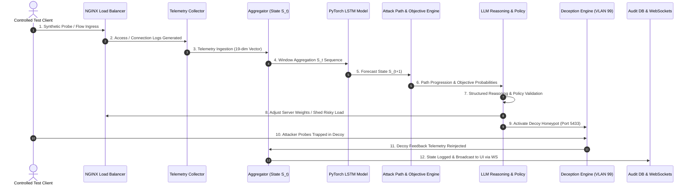

# CHRONOS-WS: End-to-End Live Data Flow Specification

## 1. Closed-Loop Pipeline Architecture

The **CHRONOS-WS** live pipeline executes a continuous, closed-loop cycle moving from raw local traffic generation to autonomous defensive action and feedback reinjection:

$$\text{Traffic} \longrightarrow \text{Telemetry} \longrightarrow S_t \longrightarrow \text{LSTM Inference} \longrightarrow \widehat{S}_{t+1} \longrightarrow \text{Attack Path} \longrightarrow \text{Objectives} \longrightarrow \text{LLM Reasoning} \longrightarrow \text{Policy Validation} \longrightarrow \text{Action} \longrightarrow \text{Feedback}$$

---

## 2. Step-by-Step Data Flow Analysis

### Step 1: Controlled Test Client Generation
- **Source**: [`test_client.py`](file:///home/kunal/Desktop/SIH/backend/app/services/test_client.py)
- **Operation**: Generates sequential phases of safe synthetic network events:
  - *Phase 1*: Benign operational flows (`web_server_01`, port 80/443).
  - *Phase 2*: Perimeter port scans (`edge_firewall_01`, SYN flags).
  - *Phase 3*: Non-destructive authentication spray (`auth_service_01`, failed login bursts).
  - *Phase 4*: Decoy interaction probes directed at isolated VLAN 99.
- **Safety**: Safe local sockets, synthetic usernames, non-destructive payloads.

### Step 2: Telemetry Ingestion & Sensor Normalization
- **Source**: [`telemetry_adapters.py`](file:///home/kunal/Desktop/SIH/backend/app/services/telemetry_adapters.py)
- **Operation**: Reads log feeds from Zeek, Suricata, syslog, and host `/proc/` metrics. Normalizes varied sources into a canonical `TelemetryEvent` schema:
  - `timestamp`: UTC ISO string
  - `source`: Sensor identifier (`zeek_monitor`, `suricata_ids`, `auth_logger`)
  - `asset_id`: Targeted asset (`auth_service_01`, `web_server_01`, `api_gateway_01`)
  - `event_type`: Event class (`TRAFFIC_FLOW`, `PORT_SCAN`, `LOGIN_ATTEMPT`)
  - `severity`: Severity rating (`INFO`, `LOW`, `MEDIUM`, `HIGH`, `CRITICAL`)

### Step 3: Time-Window Aggregation into NetworkState $S_t$
- **Source**: [`telemetry_pipeline.py`](file:///home/kunal/Desktop/SIH/backend/app/services/telemetry_pipeline.py)
- **Operation**: Groups incoming events into a sliding 10-second aggregation window. Extracts a canonical 19-dimensional feature vector:
  1. `connection_count`
  2. `bytes_in`
  3. `bytes_out`
  4. `packets`
  5. `unique_sources`
  6. `unique_destinations`
  7. `unique_ports`
  8. `syn_count`
  9. `rst_count`
  10. `request_rate`
  11. `failed_login_count`
  12. `authentication_failure_rate`
  13. `database_query_rate`
  14. `suspicious_event_count`
  15. `cpu_load`
  16. `memory_load`
  17. `active_connections`
  18. `security_risk`
  19. `asset_risk`

### Step 4: PyTorch LSTM Temporal World Model Forward Pass
- **Source**: [`world_model.py`](file:///home/kunal/Desktop/SIH/backend/app/services/world_model.py)
- **Model Checkpoint**: `checkpoints/world_model.pth`
- **Architecture**: 2-layer LSTM (Input Dimension: 19, Hidden Dimension: 64, Output Dimension: 19).
- **Inference**: Accepts normalized sequence $[S_{t-9}, S_{t-8}, \dots, S_t]$ and computes predicted next network state $\widehat{S}_{t+1}$.
- **Output**: Anticipated future connection count, anticipated auth failure rate, and anticipated security risk score.

### Step 5: Dynamic Attack Path & Objective Inference
- **Source**: [`attack_path_engine.py`](file:///home/kunal/Desktop/SIH/backend/app/services/attack_path_engine.py) & [`objective_engine.py`](file:///home/kunal/Desktop/SIH/backend/app/services/objective_engine.py)
- **Path Analysis**: Maps current and predicted state metrics against MITRE ATT&CK tactics:
  $$\text{Reconnaissance} \longrightarrow \text{Discovery} \longrightarrow \text{Credential Access} \longrightarrow \text{Lateral Movement} \longrightarrow \text{Exfiltration}$$
- **Bayesian Objective Updating**: Evaluates target port distributions to calculate posterior probabilities for attacker hypotheses:
  - $P(\text{Database Exfiltration} \mid \text{Evidence})$
  - $P(\text{Credential Harvesting} \mid \text{Evidence})$
  - $P(\text{Administrative Takeover} \mid \text{Evidence})$

### Step 6: LLM Reasoning & Defensive Strategy Formulation
- **Source**: [`llm_reasoning.py`](file:///home/kunal/Desktop/SIH/backend/app/services/llm_reasoning.py)
- **Operation**: Formulates structured situational analysis:
  - Consumes active $S_t$, forecasted $\widehat{S}_{t+1}$, attack stage, and objective likelihoods.
  - Queries local Ollama / OpenRouter LLM or uses local deterministic reasoning engine.
  - Generates recommended defensive action: `MONITOR`, `RATE_LIMIT`, `ISOLATE_SUBNET`, `DECEIVE`, or `CONTAIN`.

### Step 7: Policy Validation
- **Source**: [`policy_engine.py`](file:///home/kunal/Desktop/SIH/backend/app/services/policy_engine.py)
- **Validation**: Enforces strict operational safety invariants:
  - Production availability must never drop below 90%.
  - Critical database port 5432 cannot be severed for legitimate services.
  - Deception decoys may only be deployed into isolated VLAN 99.
  - Decision approved only if all policy rules evaluate to `APPROVED`.

### Step 8: Adaptive Defence Execution & Load Balancer Reconfiguration
- **Source**: [`adaptive_defence.py`](file:///home/kunal/Desktop/SIH/backend/app/services/adaptive_defence.py) & [`load_balancer.py`](file:///home/kunal/Desktop/SIH/backend/app/services/load_balancer.py)
- **Actions**:
  - Reconfigures load balancer server weights: shifts traffic from high-risk nodes (Server B) to nominal nodes (Server A & C).
  - Enforces firewall rate limits on offending ingress IPs (`192.168.99.150`).

### Step 9: Honeytrap Deception Deployment
- **Source**: [`deception_engine.py`](file:///home/kunal/Desktop/SIH/backend/app/services/deception_engine.py)
- **Deployment**: Activates Adaptive Decoy Database on Port 5433 and Decoy API on Port 8081.
- **Diversion**: Ingress probes seeking sensitive data are trapped in the honeypot without touching production PostgreSQL.

### Step 10: Honeypot Interaction Trapping
- **Source**: [`endpoints.py`](file:///home/kunal/Desktop/SIH/backend/app/api/endpoints.py) (`/deception/decoy-db`, `/deception/decoy-api`)
- **Trapping**: Captures malicious query string (e.g. `UNION SELECT username, password_hash FROM admin_users --`).
- **Response**: Generates realistic synthetic records (`dummy_flag: FLAG{DECOY_CAPTURED_ATTACKER}`) keeping the attacker engaged and deceived.

### Step 11: Closed-Loop Telemetry Feedback Reinjection
- **Source**: [`live_testbed.py`](file:///home/kunal/Desktop/SIH/backend/app/services/live_testbed.py)
- **Reinjection**: Generates high-confidence `FEEDBACK-DEC-XXXX` telemetry event indicating the attacker has been trapped in the honeytrap.
- **Loop Completion**: Re-enters the aggregation window at Step 2, updating future states to reflect neutralized threat risk.

---

## 3. Real-Time Broadcast & Persistence
- Every stage broadcasts event envelopes across WebSockets (`/api/v1/closed-loop/ws`) with schemas matching:
  - `telemetry_update`
  - `network_state_update`
  - `prediction_update`
  - `attack_path_update`
  - `objective_update`
  - `defence_update`
  - `load_balancer_update`
  - `deception_update`
  - `feedback_update`
- Audit events are logged to the SQLite database table `audit_logs` in `backend/chronos_ws.db`.
