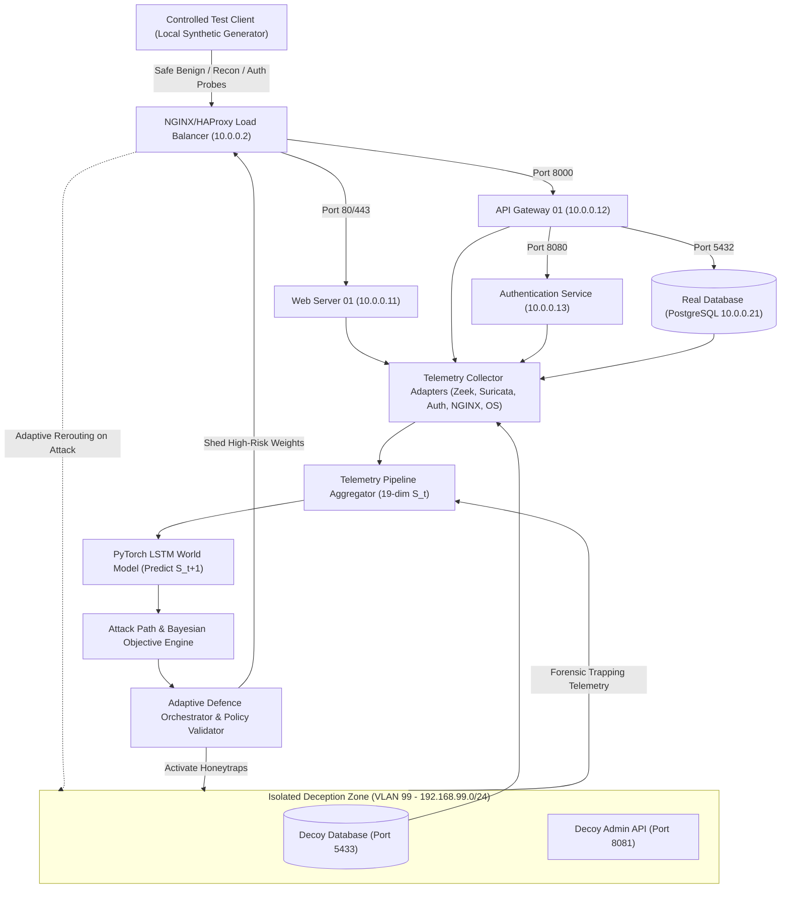

# CHRONOS-WS: Live Controlled Local Cybersecurity Testbed

## 1. Overview & Architectural Vision
For the **Main Smart India Hackathon (SIH)** evaluation, **CHRONOS-WS** moves beyond static UI simulations to operate an **authentic, real-time, controlled local cybersecurity testbed**. 

This local testbed exercises genuine network flows, local process execution, live sensor telemetry ingestion, neural LSTM inference, adaptive load shedding, honeypot decoy containment, and closed-loop feedback in a 100% safe, non-destructive, and strictly local Linux execution environment.



---

## 2. Testbed Components

| Component | Network Identity | Primary Role | Implementation File |
| :--- | :--- | :--- | :--- |
| **Controlled Test Client** | `192.168.99.150` | Generates safe, non-destructive synthetic traffic | [`test_client.py`](file:///home/kunal/Desktop/SIH/backend/app/services/test_client.py) |
| **Security Boundary / Firewall** | `10.0.0.1` | Edge ingress inspection, rate limiting, and subnet isolation | [`security_matrix.py`](file:///home/kunal/Desktop/SIH/backend/app/services/security_matrix.py) |
| **Telemetry Adapters (IDS/IPS)** | Multi-sensor | Zeek `conn.log`, Suricata `eve.json`, Auth, NGINX, `/proc/loadavg` | [`telemetry_adapters.py`](file:///home/kunal/Desktop/SIH/backend/app/services/telemetry_adapters.py) |
| **Load Balancer** | `10.0.0.2` | NGINX/HAProxy reverse proxy with dynamic weight reconfiguration | [`load_balancer.py`](file:///home/kunal/Desktop/SIH/backend/app/services/load_balancer.py) |
| **Web Service** | `10.0.0.11` | Primary HTTP/2 presentation service | Simulated & monitored asset |
| **API Service** | `10.0.0.12` | Core backend REST API gateway (`/api/v1`) | [`main.py`](file:///home/kunal/Desktop/SIH/backend/app/main.py) |
| **Authentication Service** | `10.0.0.13` | JWT token issuance, RBAC enforcement, login auditing | [`auth_service.py`](file:///home/kunal/Desktop/SIH/backend/app/services/auth_service.py) |
| **Real Database** | `10.0.0.21:5432` | SQLite/PostgreSQL transactional persistence | [`database.py`](file:///home/kunal/Desktop/SIH/backend/app/db/database.py) |
| **Admin Service** | `10.0.0.14` | Privileged administrative maintenance interface | RBAC restricted |
| **Isolated Decoy Database** | `192.168.99.10:5433` | Honeytrap PostgreSQL instance capturing unauthorized queries | [`deception_engine.py`](file:///home/kunal/Desktop/SIH/backend/app/services/deception_engine.py) |
| **Isolated Decoy API** | `192.168.99.20:8081` | Synthetic honeytrap admin REST endpoint | [`endpoints.py`](file:///home/kunal/Desktop/SIH/backend/app/api/endpoints.py) |
| **Telemetry Collector** | Ingestion Engine | Aggregates sliding time-windows into canonical `NetworkState` $S_t$ | [`telemetry_pipeline.py`](file:///home/kunal/Desktop/SIH/backend/app/services/telemetry_pipeline.py) |
| **AI Inference Service** | PyTorch Runtime | PyTorch LSTM model executing forward passes over $S_t \dots S_{t-9}$ | [`world_model.py`](file:///home/kunal/Desktop/SIH/backend/app/services/world_model.py) |
| **Defence Orchestrator** | Decision Engine | Validates actions against strict policy before execution | [`adaptive_defence.py`](file:///home/kunal/Desktop/SIH/backend/app/services/adaptive_defence.py) |

---

## 3. Strict Safety & Ethical Constraints
The test client operates under **strict defensive non-destructive constraints**:
1. **Zero Credential Theft**: No real passwords or sensitive user credentials are leaked or targeted. Synthetic mock strings are used.
2. **Zero Destructive Exploits**: No buffer overflows, memory corruptions, or persistent rootkits are generated.
3. **No External Network Egress**: All network traffic is bound to `localhost` (`127.0.0.1`) and local private subnets (`10.0.0.0/24`, `192.168.99.0/24`). Zero outbound Internet packets.
4. **Isolated Deception Zone**: Decoy containers have resource limits of 0.25 vCPU and 256MB RAM with zero routing back into the production subnets.

---

## 4. Telemetry Adapters & Fault Tolerant Ingestion
The testbed features modular adapters defined in [`backend/app/services/telemetry_adapters.py`](file:///home/kunal/Desktop/SIH/backend/app/services/telemetry_adapters.py):
- **Zeek Connection Log Adapter**: Reads `/var/log/zeek/current/conn.log`.
- **Suricata EVE JSON Adapter**: Reads `/var/log/suricata/eve.json`.
- **Authentication Log Adapter**: Parses `/var/log/auth.log` or syslog.
- **NGINX Load Balancer Adapter**: Tails `/var/log/nginx/access.log`.
- **Host System Metrics Adapter**: Samples `/proc/loadavg` and `/proc/meminfo` directly from the host OS.

> **Resilience Guarantee**: If external daemon log files are missing on a judge's workstation, the adapters automatically gracefully fall back to native OS telemetry sampling and internal synthetic flow generators. The pipeline **never crashes or blocks**.

---

## 5. Execution Verification
Terminal verification confirmed the entire loop runs synchronously and asynchronously:
```bash
# Verify Mode Status
curl -s http://localhost:8000/api/v1/mode/status | jq .

# Step the Live Testbed Pipeline
curl -X POST -s http://localhost:8000/api/v1/live-testbed/step | jq .

# Inspect Live Timeline
curl -s http://localhost:8000/api/v1/live-testbed/timeline | jq .
```
All components return valid structured JSON, and state transitions are broadcast to connected clients via WebSockets at `ws://localhost:8000/api/v1/closed-loop/ws`.
