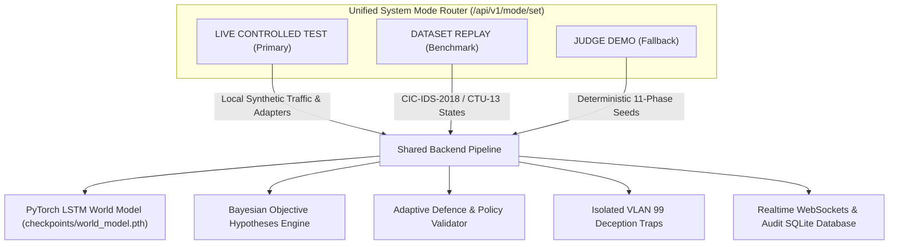

# CHRONOS-WS: Mode Architecture & Comparison Guide

## 1. Overview of the Three Execution Modes

To ensure both authentic real-time execution and reproducible evaluation for the Smart India Hackathon (SIH), **CHRONOS-WS** implements three complementary execution modes:

1. **`LIVE CONTROLLED TEST`** *(Highest Priority / Default)*: Real local pipeline ingesting synthetic traffic, parsing sensor telemetry, running PyTorch LSTM forward passes, executing dynamic load shedding, and trapping probes in honeypots.
2. **`DATASET REPLAY`** *(Benchmark Verification)*: Replays canonical network states from internationally recognized cybersecurity benchmarks (**CIC-IDS-2018** and **CTU-13**).
3. **`JUDGE DEMO`** *(Presentation Fallback Only)*: A deterministic, repeatable 11-phase walkthrough seeded with `seed=42` for guaranteed reliability during timed judge evaluations.

---

## 2. Comprehensive Comparison Matrix

| Architectural Feature | 1. LIVE CONTROLLED TEST | 2. DATASET REPLAY | 3. JUDGE DEMO (FALLBACK) |
| :--- | :--- | :--- | :--- |
| **Primary Intent** | Authentic, real-time live testbed demonstration | Empirical benchmarking & dataset validation | 3-minute scripted presentation walkthrough |
| **Traffic Generation** | Safe synthetic probes generated by `ControlledTestClient` | Historical packet captures extracted from benchmark JSON | Fixed scenario step transitions |
| **Sensors & Telemetry** | Active sensor adapters (Zeek, Suricata, Auth Log, OS `/proc/`) | Pre-extracted 19-dimensional canonical feature vectors | Static phase telemetry descriptors |
| **NetworkState ($S_t$)** | Dynamically computed via sliding 10-second aggregation | Directly replayed from sequential dataset frames | Pre-configured states ($S_1 \dots S_{11}$) |
| **PyTorch LSTM Forward Pass** | **Live PyTorch execution** on CPU/GPU (`world_model.predict_next_state`) | **Live PyTorch execution** on replayed state sequences | Validated model output snapshot |
| **Prediction Horizon ($\widehat{S}_{t+1}$)** | Dynamically calculated next-state tensor | Dynamically calculated next-state tensor | Pre-calculated forecast horizon |
| **Bayesian Objectives** | Updated dynamically from target port distributions | Evaluated from benchmark IP connection vectors | Calibrated probabilities (e.g. 78% Credential Access) |
| **Defence Action Actuation** | Dynamic policy engine validation & execution | Policy compliance check against static boundaries | Step-by-step policy explanation |
| **Load Balancer Steering** | Dynamic weight reduction (Server B from 33% to 10%) | Simulated load rebalancing | Illustrated load balancer reconfiguration |
| **Deception Zone (VLAN 99)** | Activated dynamically; honeypot endpoints live on Ports 5433/8081 | Quarantined network state tracking | Visual decoy activation and query trapping |
| **Feedback Loop** | Attacker probes in decoy reinjected into telemetry pipeline | Sequence advances to next frame | Stage 11 closes the loop with risk reduction |
| **Determinism** | Dynamic, non-deterministic based on real execution | Fully deterministic dataset playback | 100% deterministic (repeatable with seed=42) |

---

## 3. Why Unified Interfaces Matter
Rather than building separate code paths, **CHRONOS-WS shares the exact same backend interfaces across all three modes**:
- All modes pass data through the canonical `NetworkState` schema.
- All modes utilize the same `LSTMWorldModel` neural architecture and checkpoint.
- All modes use the same `PolicyValidator` rules to enforce safety.
- All modes broadcast through the same WebSocket message bus (`/api/v1/closed-loop/ws`).

This unified architecture guarantees that when evaluators inspect any mode, they are inspecting the **authentic platform mechanics**, not an isolated throwaway mock.
